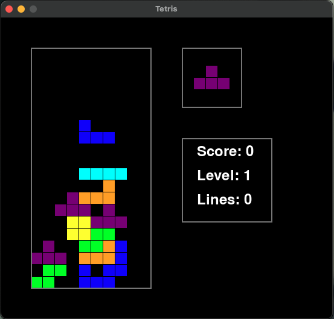

# tetris
Tetris implementation in Python; I wrote this in an evening to test out [Cursor](https://www.cursor.com/). 



## Setup
Clone the repo, cd into it, then:
```
python3 -m venv ./venv
source venv/bin/activate
pip3 install requirements.txt
```

## Gameplay
- Left arrow / right arrow to control
- Up button to rotate
- Down to hard drop
- Space to pause
- ESC to quit


## Design notes
### Game loop 
- setup
    - Start pygame
    - zero score
    - start music 
- while running:
    - check if game is lost (squares exceed top row); quit if so
    - if no active tile:
        - perform rows check; eliminate any rows that are full and add to score
        - bump queued tile to active (draw it at top)
        - randomly get a new queued tile 
    - get user input:
        - move tile left or right 
        - rotate
        - pause
        - hard drop 
    - attempt to move active tile down one square. If blocked, fill all occupied squares with
      boxes of same color and clear active tile. 

### Enhancements (once game MVP works)
- Actually display next piece 
- Draw shadow 
- level progressions with speedup
- Menu / multiple screens (options, high score, etc)
- Sound effects
- Score multipliers for clearing multiple rows 